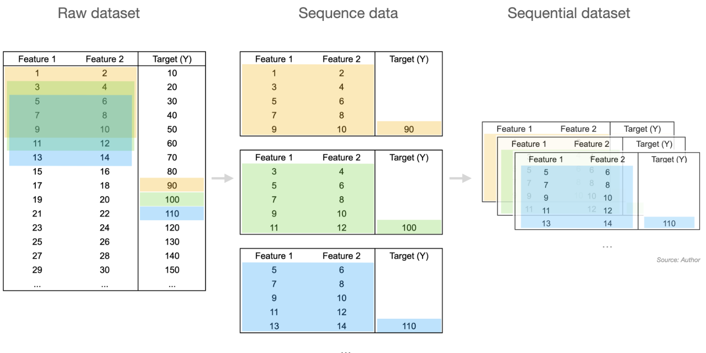
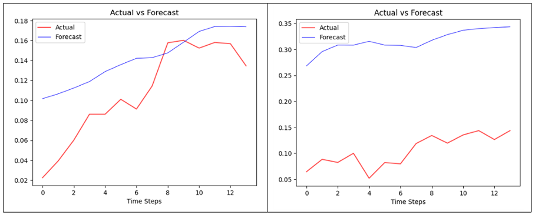
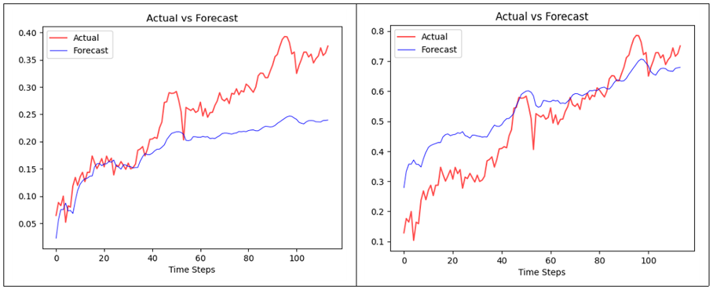
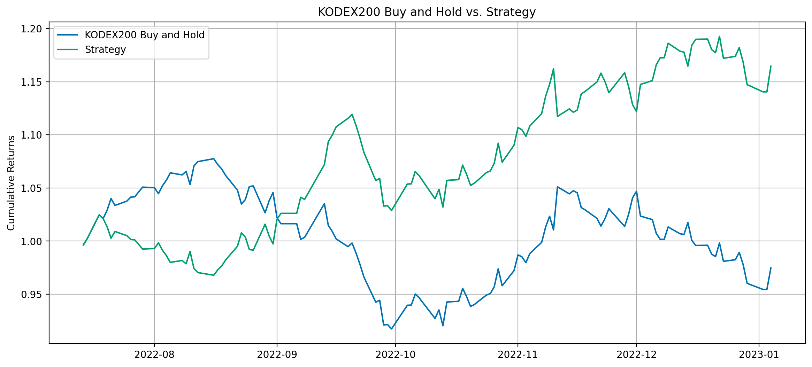

# Stock Market Prediction Project

> 기간에 따른 ETF 수익률 예측 딥러닝 모델 분석
: LSTM 과 Transformer를 활용하여
> 

- Data
    - KOSPI200 지수 추종 ETF KODEX200

- 슬라이딩 윈도우 알고리즘 활용

- 1개월 LSTM(좌)vsTransformer(우) 결과
  

- 6개월 LSTM(좌)vsTransformer(우) 결과

- LSTM 기준 백테스트 결과

- Lagging Problem 발생

